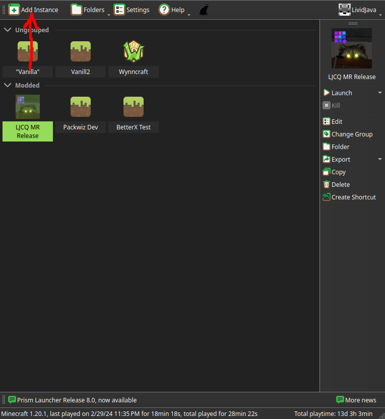
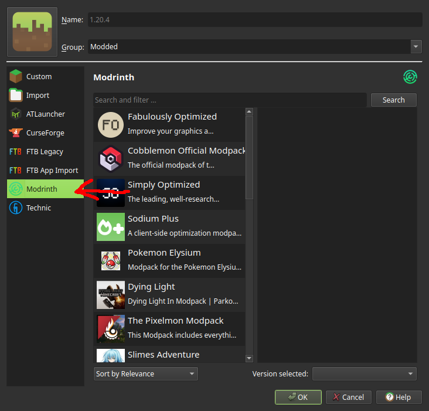
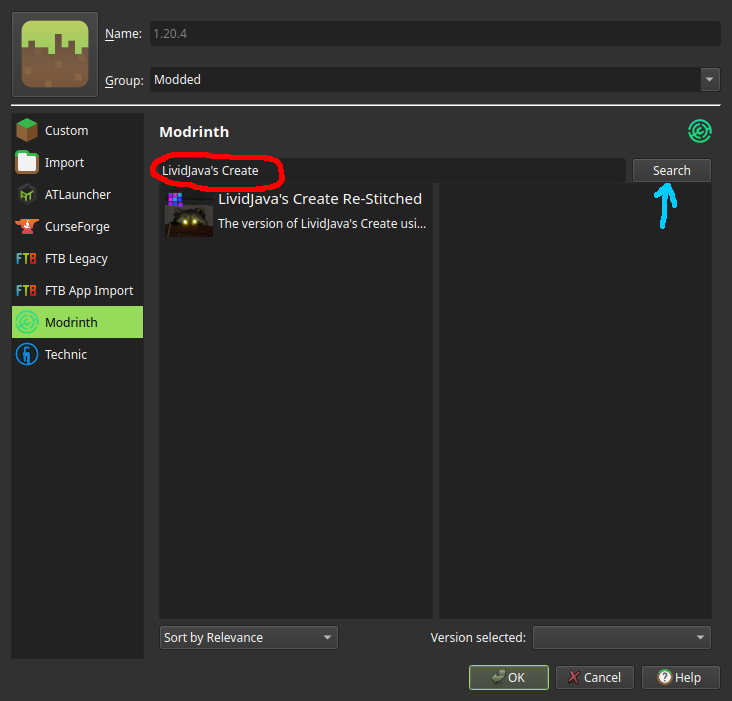
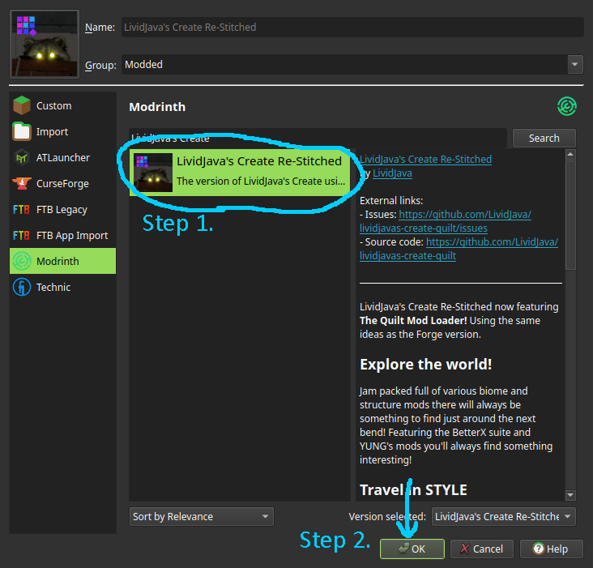
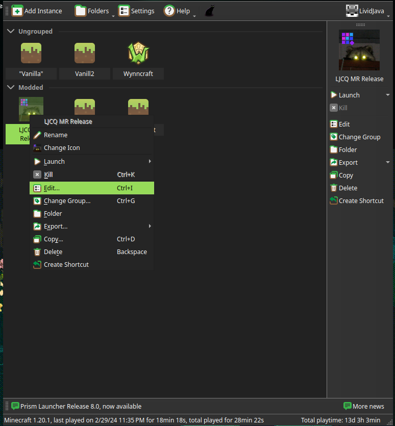
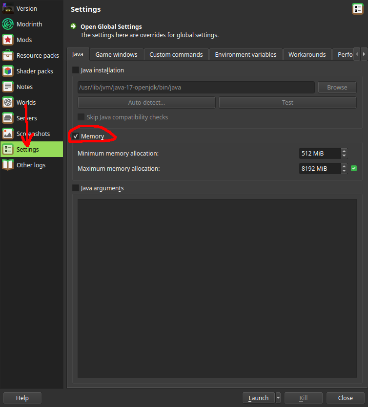
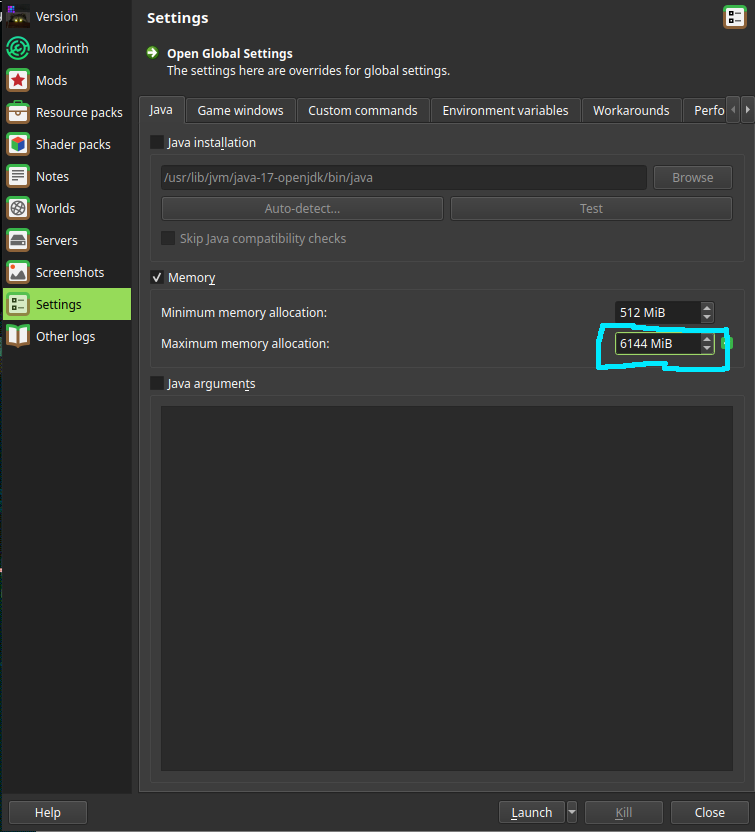

This will guide you onto installing the modpack and joining the server!

I'm assuming the following things.
1. You are using the [Prism Launcher](https://prismlauncher.org/)
2. You have a version of Java 17 installed. (In case you don't you can check [[meta.java17]] to see how to install.)

## Creating the Instance

First you're going to click on "Add Instance"

From there you're going to select "Modrinth" from the Left-hand sidebar.

In the Search Bar, type in "LividJava's Create" and click "Search".

Click on The Pack "LividJava's Create Re-Stitched" and press "OK"
 

## Troubleshooting
Sometimes things don't run right.

### Allocating more RAM
If your pc is struggling to run the modpack, you might not be allocating enough RAM. The recommend amount is At least 6GB (6144 MiB). This section will cover how to allocate more RAM to the game.

Right-click the Modpack Icon and click on "Edit...".

Click the "Settings" button on the Left-hand side, and tick the box next to "Memory".

Double-Click in the Highlighed box and replace the value with "6144" (Or higher if your system can support that).

After that. You're done!! If you have further issues, I recommend checking out the [[ljc.profiler]] article.

Also recommeneded to read up on [[Updating the Modpack|ljc.update]] so you know how!