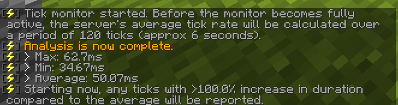
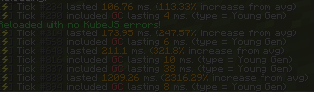
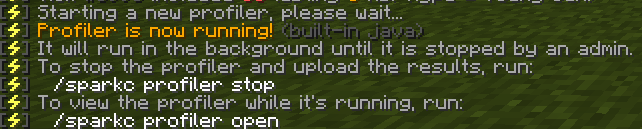
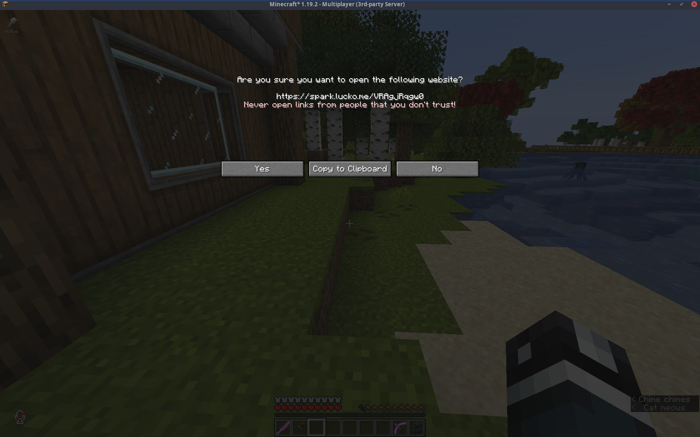

If you're experiencing lag in this modpack, this is a guide on how to pinpoint the lag (or at the very least help me help you.)

If it isn't already. Close your game and install [Spark](https://spark.lucko.me). You can test to see if it's installed by running `/sparkc` in-game, if it returns command not found, you need to install it.

## Finding Lag
After installing Spark we need to determine a few things. Firstly, how long our lag spikes last, and then we can profile our game to actually find the source of the problem.

### 1. Monitoring Ticks
First up we need to start our Tick monitor. Achieve this by running `/sparkc tickmonitor`

After the Initial analysis completes you may find some issues about GC, you can ignore this for now. Java's Garbage collector is... Garbage... We are looking for a HUGE spike in ticks.

This is a pretty Sizeable spike! so much so it kicked me from the server! (hence the dimmed screenshot)

Now we can run our profiler to try and find the actual source of the lag!

### 2. Profiling the Game
Now that we have some numbers we'll try and only capture the major spikes! First we need to take the lowest large spike, round it down to the nearest 50 and then start profiling it!

In the case above, our lowest significant spike was 106.76ms, so we'll round it down to 100

Now our profiler is running, When any spike happens over 100ms it will be captured in our profiler! We want to try and recreate the lag as best we can (while avoiding a crash!).

After we re-produce our spike, we can run `/sparkc profiler stop`

And our report will be generated!

While we're at it let's also disable the tickmonitor

Now we just click the link, and either open in browser to view it or copy to clipboard to throw at Java.

Examining the Profiler report is out of scope for this guide! You can instead follow the documentation from the [Spark page!](https://spark.lucko.me/docs/Using-the-viewer)

This guide was mostly derived from the Spark documentation anyway. Just in a more verbose manner.