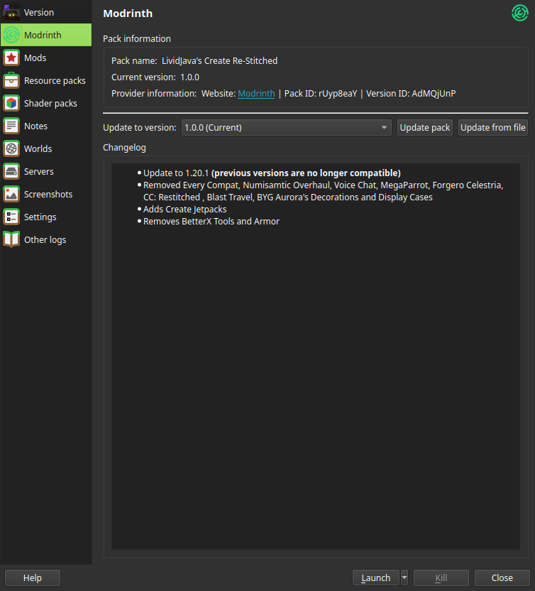
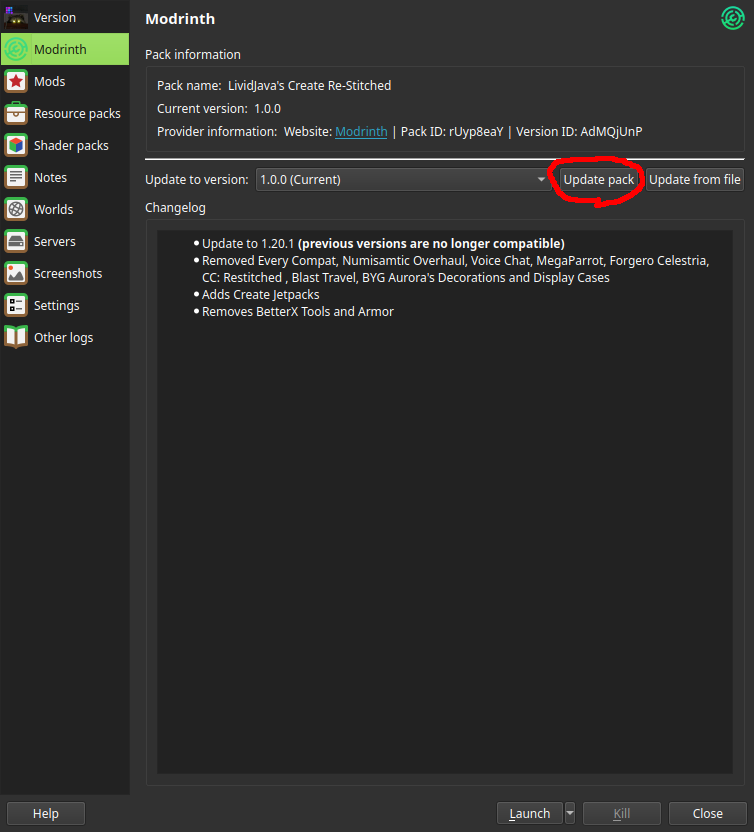

This guide will cover Updating the modpack on Prism and ATLauncher!

## Prism Launcher
Updating is pretty simple! Just tucked away! To find it we just need to do a few things. Some things to note, my Prism layout and theme may differ slightly from yours.

### Accessing the Pack Window & Updating
First up Click on "Edit", either by selecting the Pack Icon and clicking "Edit", or by Right-Clicking and Selecting Edit

Then from there, click on the "Modrinth" Tab!

Lastly, click "Update Pack" and you're up and running!
