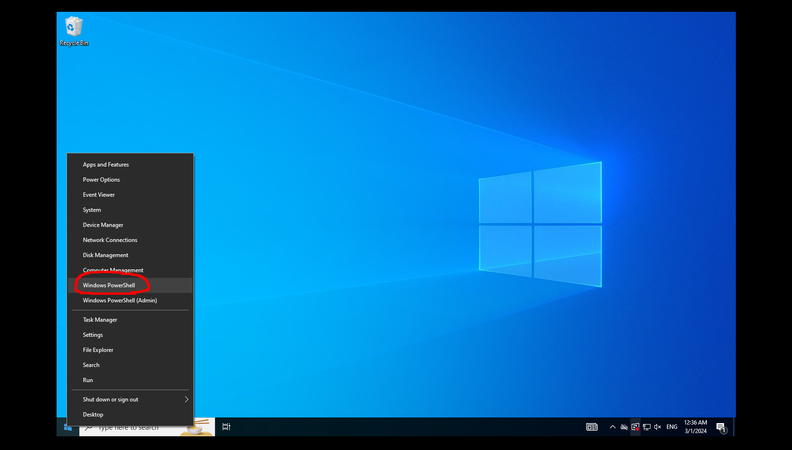
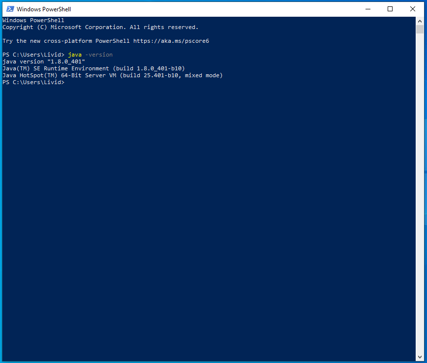
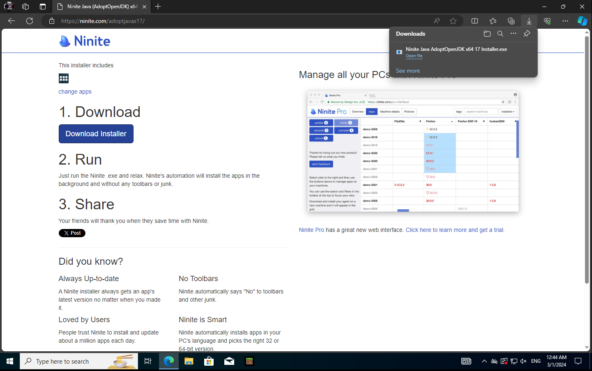
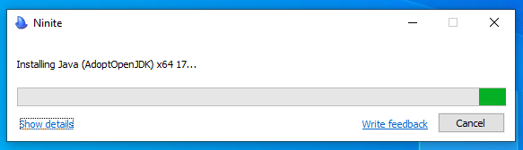
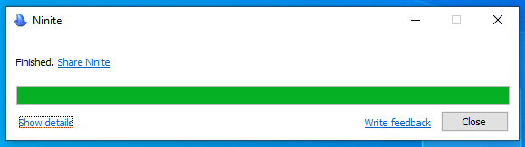
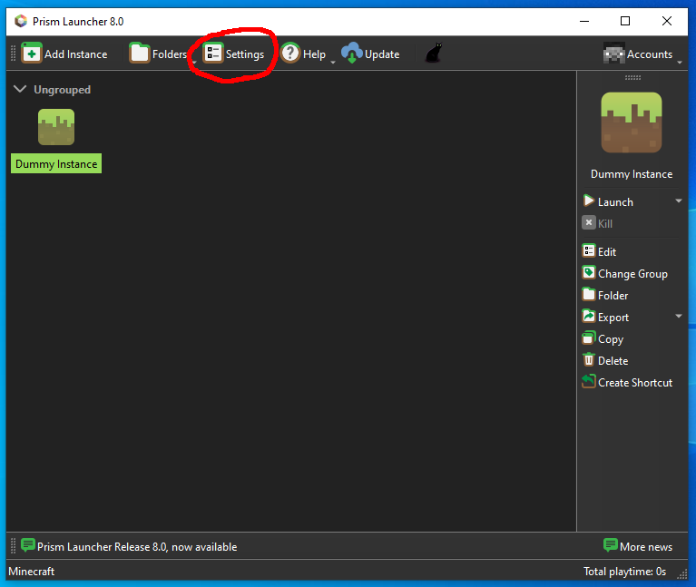
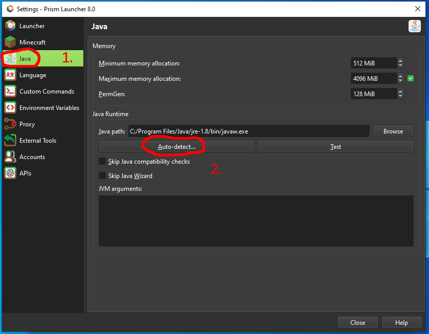
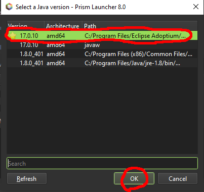

This guide will show you how to install Java 17 on a Windows Machine (if you're using Mac I cannot help. If you're using Linux, you already know what to do).

This guide assumes the following:
1. You are using Windows 10.
2. You are setting up Java for the Prism Launcher.
3. You have already setup and installed Prism Launcher.

While screenshots will be from Windows 10, I will also add information about Windows 11.

## Checking the Installed Java Version
First we want to see if you *actually have* Java installed.

Right-Click the Start Menu button and select "Windows Powershell"


Next, in the window that opens type in `java -version` and press <kbd>Enter</kbd>


It should spit out the following information
```
Java Version X.X.X_xxx
Java(TM) SE Runtime Environment (build X.X.X_xxx-xxx)
Java Hotspot(TM) XX-Bit Server VM (build XX.XXX-xxx, mixed mode)
```

The correct version should be `17.0.10`. If in that text you see `1.8.0` next to `Runtime Enviroment` you have the incorrect version of Java and need to install the correct version.

## Installing the Right Version of Java
If from the above section you have the incorrect version of Java we need to download the correct version.

First download this [Ninite Installer](https://ninite.com/adoptjavax17/).

Then press the big blue "Download Installer" button.


After it downloads, open the installer and let it do its thing.


It will automatically install and setup Java 17 for you, when finished it will appear as so:


You can click close and move on to setting up for Prism.

## Setting up Prism
We've installed the correct version of Java, now we need to let Prism Launcher know where it is.

First, Click on "Settings" in the Top Bar.


Then click on "Java" > "Auto-Detect"


From there, Select "17.0.10" and press "OK" (Usually it's the version with the "⭐" )


After that, Close the settings window and Launch your game!