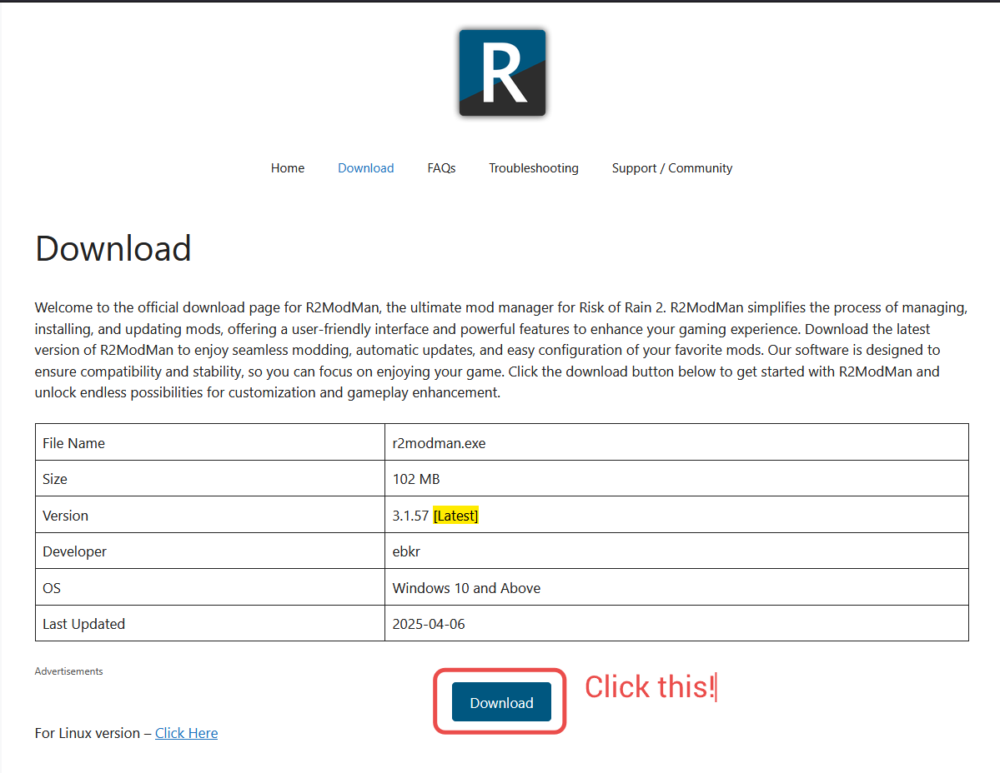
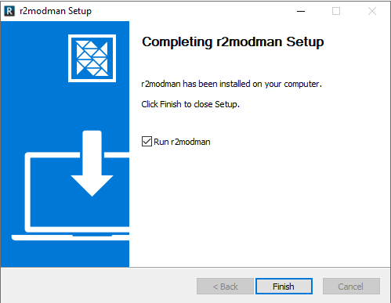

This guide will show you how to install r2modman.

This guide assumes the following:
1. You are using Windows 10/11.
2. You already have Steam and the relevant game installed.

## Installing R2ModMan

Head to the [r2modman](https://r2modman.com/download/) website and click Download.

After downloading, Run the installer as you normally would. If you encounter an Unknown publisher error, click **More Info** and run anyway.

Once installation is finished you should see this screen:

Click finish and Launch r2modman! If you're here for the Racc Pack you can now head to [[raccpack.install]].