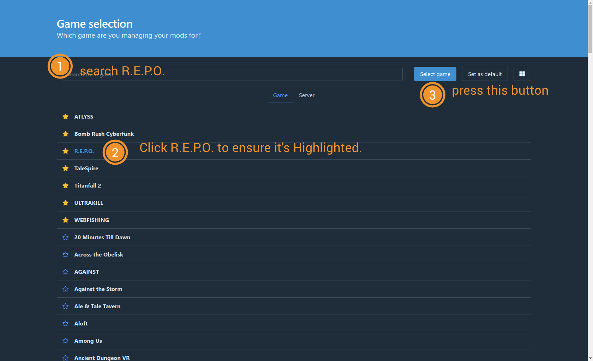
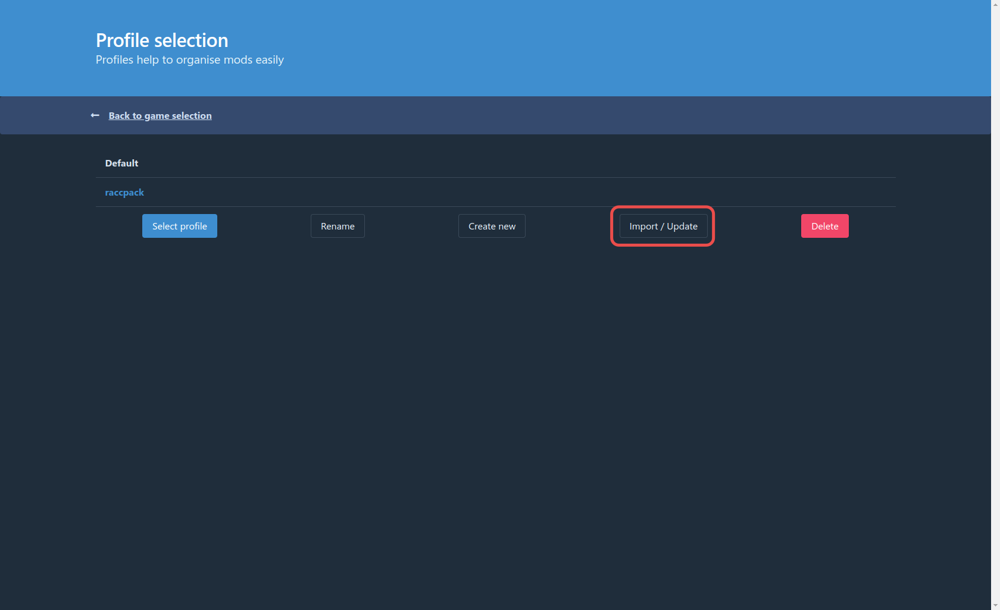
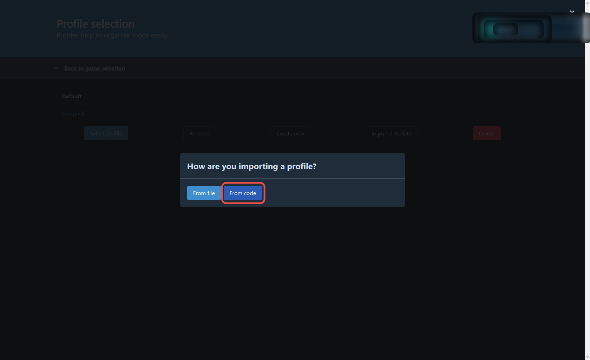
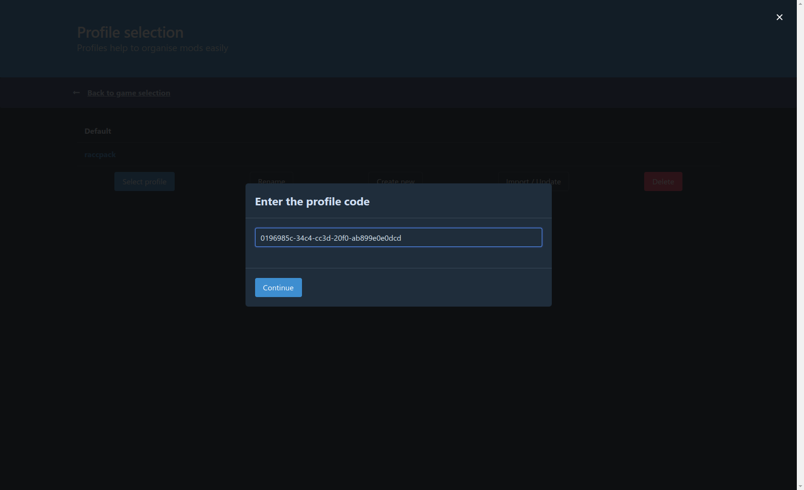
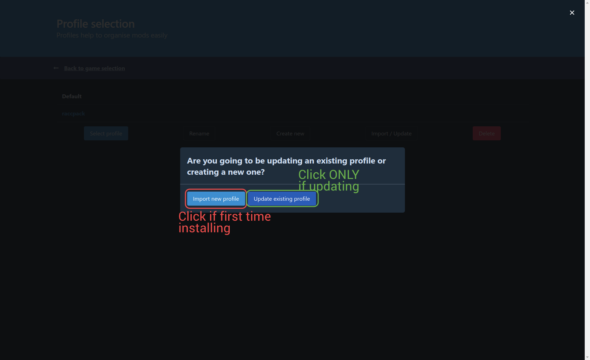
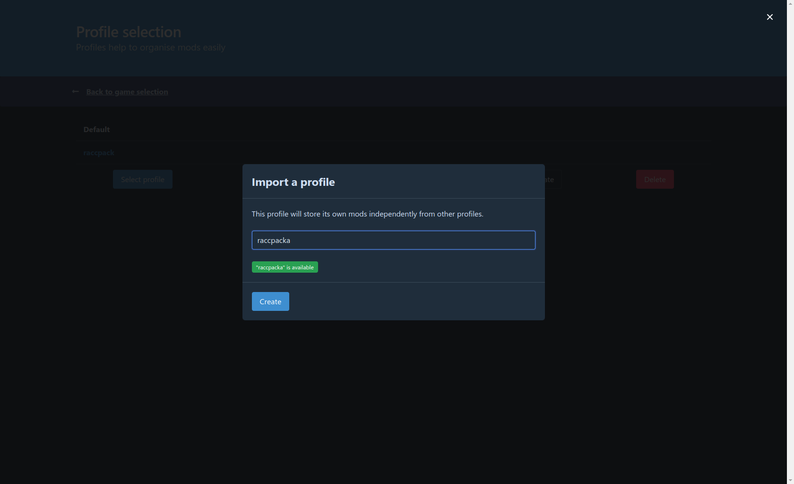
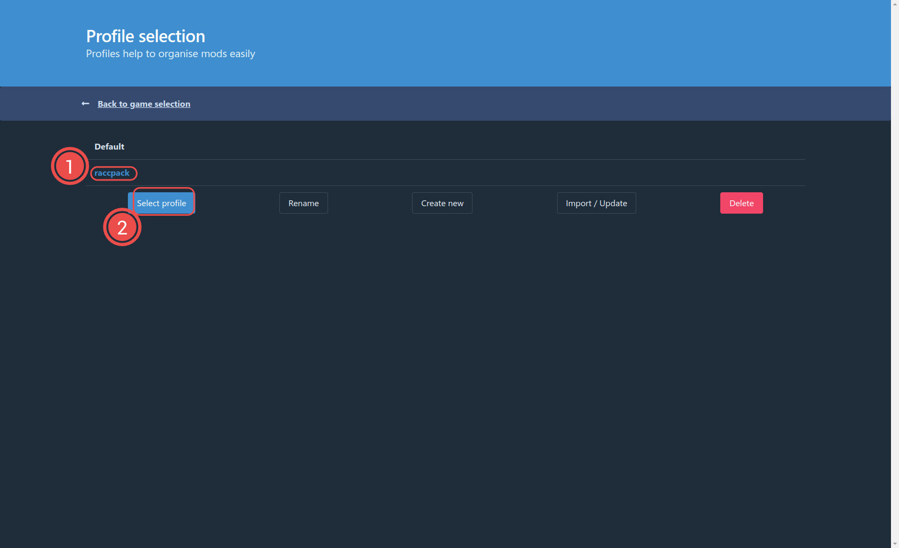
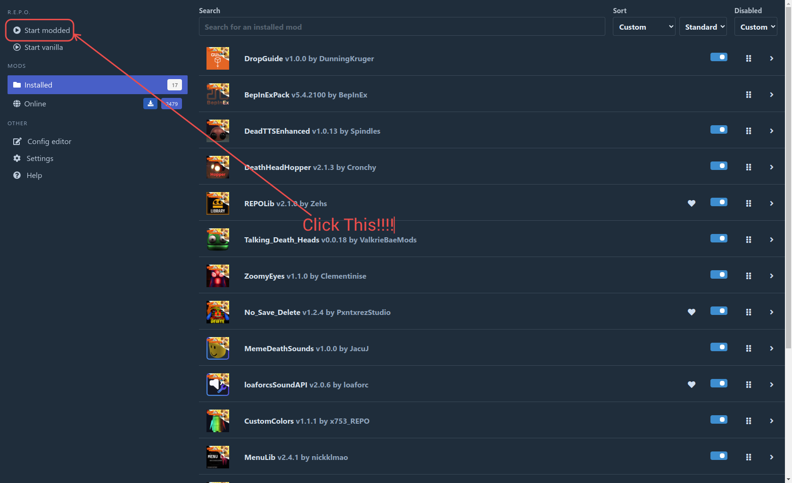

This guide will take you through the process of installing The Racc Pack.

I'm assuming the following:
1. You have r2modman installed. (if you do not have r2modman installed you can follow [[this guide|meta.r2modman]] to do so.)
2. You are using a Windows device.
3. You have R.E.P.O. installed in a path discoverable by Steam.

## Selecting a game
By default r2modman will not have any game selected, or favorited. You can search for R.E.P.O. in the list.

1. Click the search box at the top an search for 'R.E.P.O.'
2. Click R.E.P.O. to highlight it blue
3. Click Select game.

**It is highly recommended you click the star next to the Game title to bring it to the top of your list**

## Installing the Pack
After Selecting the game, Click "Import/Update"

Select "From code"

Paste the code in the following screen and press **Continue** then press **Import**

Click **Import new profile** if this is the first time installing. If you are updating, click **Update Existing Profile**.

Give it a name (Or select the previous name), and press Create (or update).

Click the profile to ensure its highlighted  Blue and click **Select Profile**

Lastly, click **Start Modded** and the game will launch.
